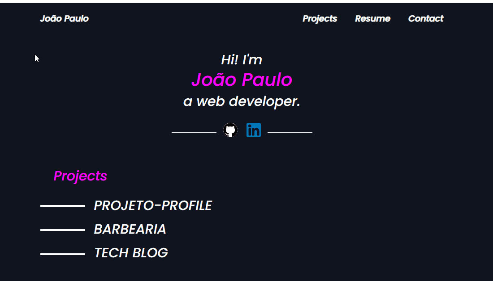

<h1 align = "center">Primeiro Projeto Pessoal</h1>
<h2 align = "center"> Meu primeiro projeto pessoal realizado, usando como inspiração um repositorio no GitHub.</h2>

    

<h2>🚀🚀 Tecnologias 🚀🚀</h2>

- ✅ HTML
- ✅ CSS

<h2> 💻📲 Como usar 💻📲 </h2>

- 📱💻 Baixe o Zip e execute o Index.html no diretório pages

